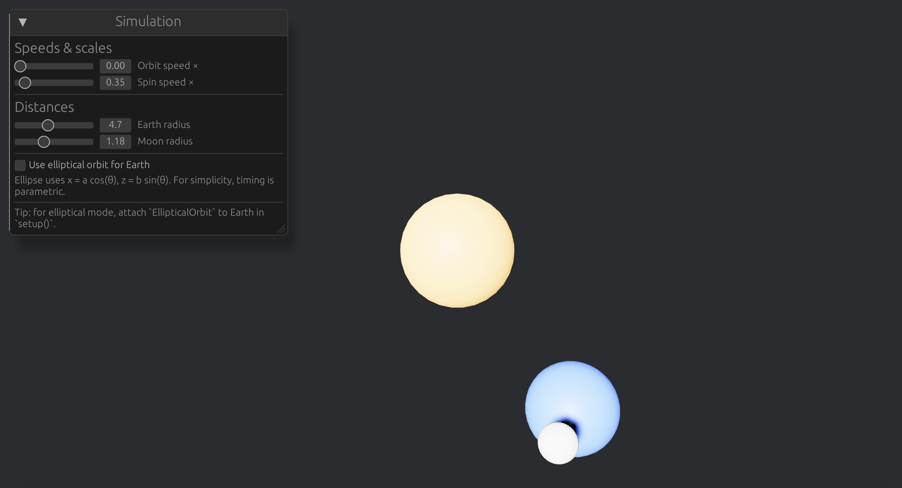

# orbits-sun-earth-moon

A small 3D project built with **Bevy** to explore the **ECS** pattern:  
the Sun, the Earth (with tilt), and the Moon, all orbiting with hierarchical transforms, optional ellipses, and a minimal **UI** (sliders) to tweak speeds and distances.

---

## Why ECS?

**ECS** = **E**ntity – **C**omponent – **S**ystem.

In this project:

- **Entity**: the *things in the world*.  
  Examples: `Sun`, `Earth`, `Moon`, but also *orbit pivots* (empty entities used as rotation anchors).  
  → In the code: `commands.spawn((PbrBundle { ... }, Sun))`, etc.

- **Component**: the *data attached to entities* (no logic).  
  Examples:  
  - `Orbit { angular_speed }`: marks a pivot that rotates to move its children in a circle.  
  - `Spin { angular_speed }`: makes an entity rotate around its own local Y-axis.  
  - `EllipticalOrbit { a, b, angular_speed, theta }`: drives position along an ellipse (optional).  
  - Marker tags `Sun`, `Earth`, `Moon`: simple filters.

- **System**: the *functions* that run each frame, reading/writing components.  
  Examples:  
  - `animate_orbits`: rotates pivots with `Orbit`.  
  - `spin_bodies`: rotates entities with `Spin`.  
  - `animate_elliptical_orbits`: places Earth on an ellipse if enabled.  
  - `enforce_orbit_radii`: reapplies distances when sliders change.  
  - `ui_panel`: displays sliders (via `bevy_egui`).

---

## Features

- Spatial hierarchy (Sun → Earth pivot → Earth → Moon pivot → Moon).  
- Earth axial tilt (≈ 23.44°).  
- Two orbit modes: circular (pivot rotation) or elliptical (parametric).  
- **UI sliders** to adjust in real time:
  - orbit and spin speeds,
  - Sun–Earth and Earth–Moon distances,
  - enable/disable elliptical orbit.

---

## Requirements

- **Rust** ≥ 1.75 (install via `rustup`).  
- Desktop platform (macOS/Windows/Linux).  
  On Apple Silicon, Bevy uses **Metal** by default.

Dependencies (`Cargo.toml`):
- `bevy = "0.14"`
- `bevy_egui = "0.28"`

---

## Run (Desktop)

```bash
# Clone
git clone https://github.com/<you>/orbits-sun-earth-moon.git
cd orbits-sun-earth-moon

# Debug build
cargo run

# Optimized build
cargo run --release


<p align="center">
  
</p>